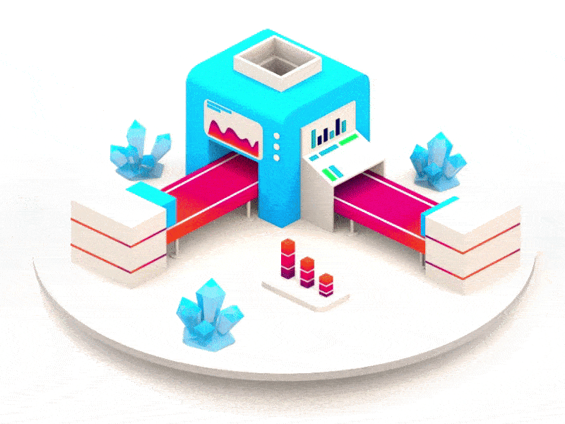

## Procesamiento de Datos con Python
#### BEDU Tech - Data Analysis (Grupo DABTCMX152020)

### Descripción :pencil:

El módulo de __Procesamiento de Datos con Python__ tiene como principal objetivo utilizar __Python__ para crear funciones y *scripts* que permitan automatizar la obtención, limpieza, procesamiento y transformación de datos provenientes de diferentes fuentes y formatos como: archivos locales, APIs y Bases de Datos externas con el fin de tener datos en condiciones óptimas para su futuro análisis y visualización.

### Información General :information_source:

- **Experto:** L. en C.C. Manuel Soto Romero
- **Horario:** Sábados 9 a 15 hrs.
- **Lugar:**   En línea.

### Material adicional :books:

### Agenda :date:

*13 de marzo al 17 de abril de 2021*

Fecha | Sesión | Tema                                                               | 
------| :----: | :----------------------------------------------------------------- | 
13/03 | 1      | [Fundamentos de Python](Sesion-01/Readme.md)                       |
13/03 | 2      | [Estructuras de Datos y Funciones](Sesion-02/Readme.md)            |
20/03 | 3      | [Programación Funcional y Operadores Lógicos](Sesion-03/Readme.md) |

